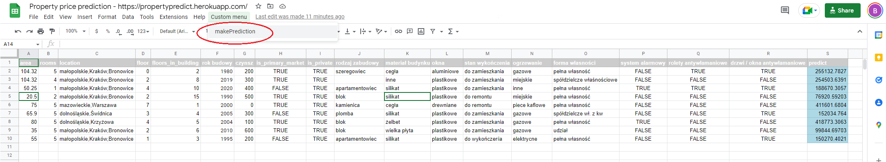

# Property Price Prediction
> Machine Learning model forecasting property prices on the Polish market.  
> Live demo [_here_](https://propertypredict.herokuapp.com/)

## Table of Contents
* [General Info](#general-information)
* [Technologies Used](#technologies-used)
* [Screenshots](#screenshots)
* [Setup](#setup)
* [Usage](#usage)
* [Project Status](#project-status)
* [Acknowledgements](#acknowledgements)
* [Contact](#contact)

## General Information
The idea was to create a machine learning model forecasting property prices.  
The data came from polish property advertisement site and it was gather by https://dataworkshop.eu/.  
Data contains 46489 rows in train data and 46275 rows in test data.  
Additionally external data about polish cities and provinces from wikipedia was used.     
The project contains three main jupyter notebooks:
- 01_model_experiments.ipynb - Prepere, wrangle and analyse data. Experiments with diffrent models to pick the best performing one. MLflow used to track everything.
- 02_final_model_training.ipynb - This part contains training final model (Catboost was selected) and exporting it to file.
- 03_model_deploy.ipynb - Creates, ready to deployment, flask application file ("prediction_server.py") with implemented our prediction model. 

## Technologies Used
- Python - version 3.10
- Flask - version 1.1.2
- Google Sheets
- Jupyter Lab
- Pandas - version 1.0.5
- Scikit-learn - version 0.23.1
- Catboost - version 1.0.0
- MLflow - version 1.15.0

## Screenshots

## Setup
to be completed

## Usage
to be completed

## Project Status
Project is: _in progress_

## Acknowledgements
- This project was created as part of the https://dataworkshop.eu/ "DWSolution" initiative.
- Many thanks to https://dataworkshop.eu/ club members
 and [@Vladimir](https://github.com/slon1024) for being great teacher.
- README inspired by [@flynerdpl](https://www.flynerd.pl/) cheatsheet.

## Contact
Created by [@Bartosz Kowalik](https://www.linkedin.com/in/bartosz-kowalik-5756ba1b3/) - feel free to contact me! 
